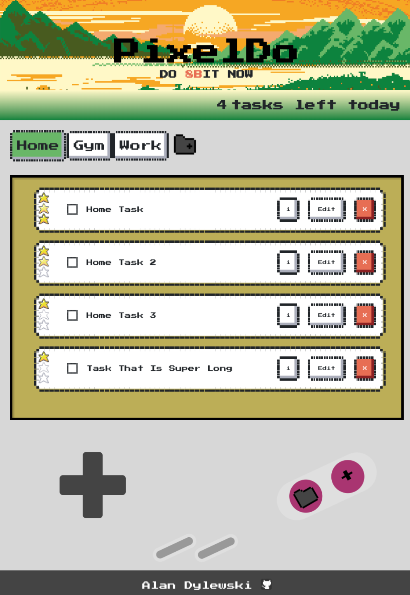

# todo-list

PixelDo: A Retro-Inspired 8-BIT ToDo App for Nostalgic Productivity 🎮✨.

Live 👉 https://dylewskii.github.io/todo-list/

## Project Objectives:
- View all projects.
- View all todo's in each project.
- Expand a single todo to see/edit its details.
- Delete a todo.

## Focus Points:
- Separate code logic.
- Get accustomed to saving data to localStorage.

## Final Outcome:

## Future Improvements:
- Add ability to edit projects.
- Make the screen more responsive.
- Thoroughly test for bugs.

## Languages used:
-    
-    
- 

## Credits:
- Header = <a href="https://www.freepik.com/free-vector/pixel-art-rural-landscape-background_49685500.htm">Image by pikisuperstar</a> on Freepik
